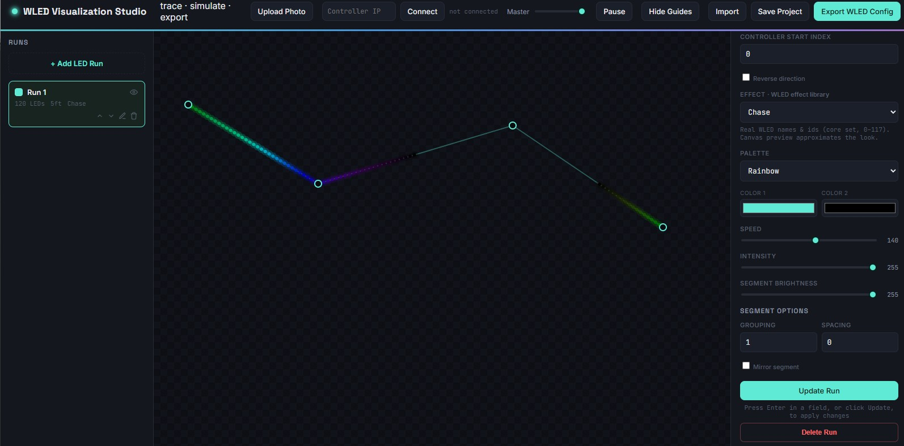

# WLED Visualizer

A browser based [WLED](https://github.com/wled/WLED) simulator for mapping displays similar to more advanced apps like xLights/Vixen. In effect, this is to help hobbyists design LED displays (especially external ones) without having to sit in sweltering/freezing/snowy/rainy or otherwise less than ideal outdoor conditions to get their display just right.

## Project Goals

- Draw and define vector LED strip/string runs
- Import reference photo(s) to draw over
- Connect, import and export to live controllers
- Multiple controller support
- Export / Save projects locally
- Implement and maintain as many WLED effects, palettes and options (segmentation, layering, matrices, blending) as possible

## Current Features

- Click-to-create multiple runs as vector segments
- Show/Hide vector guides
- Run length/count definition
- Photo reference import
- Project import/export
- 118 WLED effects selectable by their real name and id, with 24 built-in simulations approximating them when you're working offline
- 72 pre-defined color palettes scraped from palettes.cpp
- Connect to a live controller and read its effect list, palettes and device info
- **Live Mirror** — show exactly what the controller is doing, LED for LED
- New runs take their LED count and start index from the connected controller

## User interface



## Live Mirror

Connect to a controller, then press **Live Mirror**. The canvas stops guessing and starts showing the real thing.

WLED can stream the actual contents of its LED buffer over a websocket — the same feed its built-in Peek uses. Live Mirror asks for that stream and paints those colors straight onto the runs you've drawn. What you see is what the strip is doing: the real effect at the real speed, with brightness, grouping, spacing and segment bounds already applied by the controller. Effects that no simulator could reproduce, like the audio-reactive ones, come through correctly because nothing is being simulated.

The badge next to Connect tells you which mode you're in:

| Badge | Meaning |
| --- | --- |
| `● LIVE · PIXEL` | Painting real LED colors streamed from the device |
| `● LIVE` | Device isn't streaming, so effects are simulated locally from its segment settings |

If the stream stops, it falls back to the local simulation on its own, so older firmware and devices without live view still work.

While mirroring, a run's effect, palette, colors, speed and segment options follow the device and are overwritten on each update. Its **geometry is left alone** — LED count and start index are the layout you drew, and they're what gets exported, so the device never silently rewrites them. When a run disagrees with the segment it mirrors, the inspector says so and offers to adopt the device's numbers.

Live Mirror only reads from the controller. Nothing is written to your device unless you use Export.

## Installation

Download the HTML folder and open index.html. That's pretty much it.

There's no build step and nothing to install. The app is still plain HTML, CSS and JavaScript that runs straight from the folder.

## Development

Only needed if you're changing the code. The app itself has no dependencies.

```
npm install
npm test
```

Tests cover the live-view protocol handling — frame parsing, LED index mapping, the fallback to simulation, and how device state maps onto runs.

## What's lacking

A lot, actually. There's a lot I'd like to do here, but my JS skills aren't super strong and vibe coding can only go so far. This v0.01 hopefully acts as a solid jumping off point to someone more knowledgeable than I in translating (maybe even interfacing) the arduino libraries from the actual WLED repo into a web interface. I'd like this to be a more robust, feature rich version of WLED's native Peek function.

[Live Mirror](#live-mirror) is a first pass at that last part — it streams the controller's real LED buffer rather than approximating it. Still on the list, roughly in the order they'd help most:

- **Multiple controller support.** One `controllerIp` today, so a project can only describe one ESP32.
- **Import a project from a connected controller.** Connect and export work; import only updates existing runs, so an already-built display has to be recreated by hand.
- **More simulated effects.** 118 effects are selectable by real name and id, with 24 simulation renderers behind them, so some still preview as an approximation of something else. Only matters offline — a connected controller is exact via Live Mirror.
- **Segmentation.** One run maps to one segment; WLED allows several segments per strip.
- **2D matrix support.** Runs are 1D paths, and a lot of modern WLED effects are 2D-native.
- **Effect layering and blending.** Runs render independently and can't overlap.

## Everything else

Credit especially to all WLED [contributors](https://kno.wled.ge/about/contributors/)!
And a super special thanks to [Aircookie's incredible firmware](https://github.com/wled/WLED). WLED has single handedly allowed me to up my holiday decorating game.

You can occasionally find me on the Discord server.

<a href="https://discord.gg/QAh7wJHrRM"></a>
